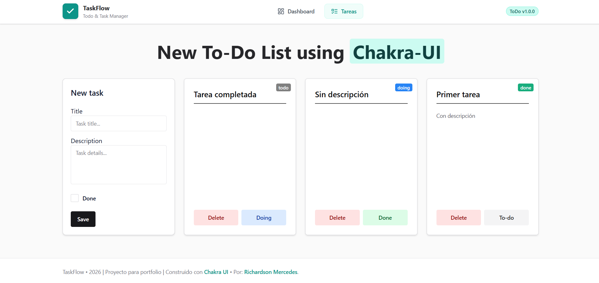
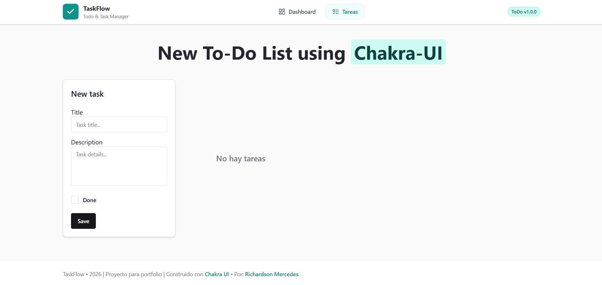
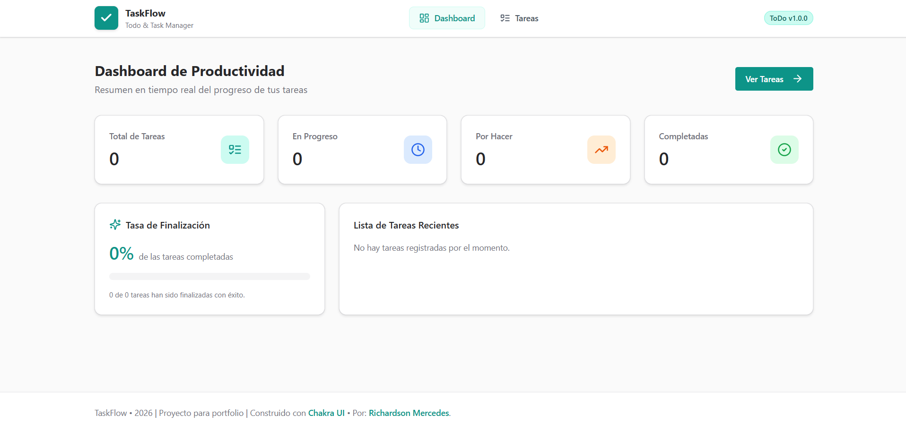

# 📝 To-Do List App — Chakra UI & React

Una aplicación moderna, rápida e intuitiva para la gestión y seguimiento de tareas diarias, construida con **React**, **TypeScript**, **Chakra UI** y **Vite**. Cuenta con persistencia automática en `localStorage`, métricas en tiempo real en un panel de productividad (Dashboard), sistema de confirmación para eliminar tareas, estado de visualización cuando no hay tareas y una interfaz limpia y responsiva.

---

## 🔗 Enlaces del Proyecto

<div style="display: flex; justify-content: center; gap: 30px;">

🌐 **[Probar ToDoList](https://todo.devhubs.online)**

👨‍💻 **[Desarrollador - Richardson Mercedes](https://richard.devhubs.online)**

</div>

---

## 📸 Capturas de Pantalla

### 📋 Tablero Principal de Tareas

<!-- REEMPLAZAR CON CAPTURA DEL TABLERO DE TAREAS -->


_Vista principal con el formulario de creación y las tarjetas de tareas organizadas dinámicamente._

### 📭 Estado Vacío (Sin Tareas)

<!-- REEMPLAZAR CON CAPTURA DE ESTADO VACÍO -->


_Vista del tablero cuando no hay tareas registradas, mostrando un mensaje informativo claro._

### 📊 Dashboard de Productividad

<!-- REEMPLAZAR CON CAPTURA DEL DASHBOARD -->


_Panel de métricas con estadísticas en tiempo real: total de tareas, tareas en progreso, por hacer, completadas y tasa de finalización._

---

## ✨ Características y Funcionalidades

- **⚡ Operaciones CRUD Completas**:
  - **Crear**: Añade nuevas tareas especificando título, descripción y estado inicial con validaciones.
  - **Leer**: Visualización organizada en tarjetas con scroll independiente y ajuste automático para descripciones extensas.
  - **Estado Vacío Amigable**: Mensaje informativo ("No hay tareas") centrado cuando el listado de tareas está vacío.
  - **Editar / Transición de Estados**: Ciclo de vida dinámico entre estados (`todo` ➔ `doing` ➔ `done` ➔ `todo`) con un solo clic.
  - **Eliminar con Confirmación**: Protección contra borrado accidental mediante un modal de confirmación interactivo ("Confirmar" / "Cancelar").
- **🚨 Sistema Global de Alertas y Modales (`AlertProvider`)**:
  - **Modo Informativo**: Notificaciones de error o validación (ej. El título es requerido).
  - **Modo Decisión / Confirmación**: Diálogos con botones personalizables para confirmar acciones críticas.
  - Cierre intuitivo mediante el botón de cierre (✕), botones de acción o haciendo clic en el fondo oscuro.
- **💾 Persistencia en Almacenamiento Local (`localStorage`)**:
  - Todas las tareas se guardan y sincronizan automáticamente.
  - Carga segura de datos al iniciar la aplicación.
- **📈 Dashboard de Métricas en Tiempo Real**:
  - Vista principal (`/`) con contador de total de tareas, tareas pendientes, en progreso y completadas.
  - Barra de progreso interactiva con porcentaje de finalización.
  - Listado de tareas recientes.
- **🎨 Diseño UI/UX Moderno**:
  - Componentes accesibles y estilizados con **Chakra UI**.
  - Distribución responsiva en cuadrícula adaptable (`SimpleGrid`).
  - Paleta de colores armoniosa con badges indicativos por cada estado.
- **🧭 Enrutamiento con React Router DOM**:
  - Navegación fluida entre el Dashboard (`/`), la vista de Tareas (`/tareas`) y página 404 personalizada (`NotFound`).

---

## 🛠️ Tecnologías Utilizadas

- **Frontend Core**: [React 19](https://react.dev/) + [TypeScript](https://www.typescriptlang.org/)
- **Build Tool**: [Vite](https://vitejs.dev/)
- **Librería de Componentes & Estilos**: [Chakra UI v3](https://chakra-ui.com/) + [@emotion/react](https://emotion.sh/)
- **Iconos**: [React Icons](https://react-icons.github.io/react-icons/) (Lucide Icons `react-icons/lu`)
- **Enrutamiento**: [React Router DOM v7](https://reactrouter.com/)
- **Temas**: [next-themes](https://github.com/pacocoursey/next-themes)

---

## 📂 Estructura del Proyecto

```text
todo-list/
├── public/
│   ├── favicon.svg             # Icono de la pestaña del navegador
│   └── screenshots/           # Directorio para capturas de pantalla
│       └── README.md
├── src/
│   ├── components/            # Componentes reutilizables
│   │   ├── Alert.tsx          # Componente modal de alerta y confirmación
│   │   ├── CardTask.tsx       # Tarjeta individual de tarea
│   │   ├── FormNewTask.tsx    # Formulario para registrar tareas
│   │   ├── Navbar.tsx         # Barra de navegación principal
│   │   └── ui/                # Proveedores y utilidades de Chakra UI
│   ├── hooks/                 # Custom Hooks
│   │   ├── useStorage.ts      # Hook principal para sincronización y CRUD con localStorage
│   │   └── useTodos.ts        # Hook puente para gestión de tareas
│   ├── layout/                # Estructura del Layout principal
│   │   └── Layout.tsx
│   ├── pages/                 # Páginas de la aplicación
│   │   ├── Dashboard.tsx      # Vista inicial con métricas de productividad
│   │   ├── NotFound.tsx       # Vista para rutas inexistentes (404)
│   │   └── Todos.tsx          # Tablero de gestión de tareas (/tareas)
│   ├── providers/             # Proveedores de contexto de React
│   │   └── AlertProvider.tsx  # Contexto global para alertas y modales de confirmación
│   ├── routes/                # Configuración de rutas
│   │   └── routes.tsx
│   ├── App.tsx                # Entrada principal de la aplicación
│   ├── main.tsx               # Bootstrap de React
│   └── index.css              # Estilos globales
├── index.html                 # Plantilla HTML con Favicon y Meta Tags
├── package.json               # Dependencias y scripts
├── tsconfig.json              # Configuración de TypeScript
└── vite.config.ts             # Configuración de Vite
```

---

## 🚀 Instalación y Puesta en Marcha

### Prerrequisitos

Asegúrate de tener instalado [Node.js](https://nodejs.org/) (versión 18 o superior recomendada) y `pnpm` o tu gestor de paquetes preferido.

### Pasos

1. **Clonar el repositorio**:

   ```bash
   git clone <URL_DEL_REPOSITORIO>
   cd todo-list
   ```

2. **Instalar las dependencias**:

   ```bash
   pnpm install
   ```

3. **Ejecutar el servidor de desarrollo**:

   ```bash
   pnpm run dev
   ```

   La aplicación se abrirá en `http://localhost:3000` (o el puerto configurado).

4. **Compilar para producción**:

   ```bash
   pnpm run build
   ```

5. **Previsualizar la compilación**:

   ```bash
   pnpm run preview
   ```

---

## 🧠 Documentación de Hooks Principales

### `useStorage` (`src/hooks/useStorage.ts`)

Hook encargado de la persistencia de datos en `localStorage` con la clave `"todos"`:

- `todos`: Arreglo de tareas actualmente almacenadas.
- `addTodo({ title, description, status })`: Inserta una nueva tarea generando un identificador único.
- `updateTodo(id, updatedFields)`: Modifica los campos de una tarea existente.
- `deleteTodo(id)`: Elimina la tarea especificada por su `id`.
- `retrieveStorage()`: Lee y sincroniza manualmente los datos almacenados.
- `saveStorage(newTodos)`: Sobrescribe el almacenamiento completo.

### `useAlert` (`src/providers/AlertProvider.tsx`)

Hook para abrir diálogos informativos o modales interactivos de confirmación:

```tsx
const { showAlert } = useAlert();

// Alerta informativa:
showAlert({
  title: "Campo requerido",
  message: "Debes ingresar un título para la tarea.",
});

// Modal de confirmación:
showAlert({
  title: "Eliminar Tarea",
  message: "¿Estás seguro de que deseas eliminar esta tarea?",
  confirmText: "Eliminar",
  cancelText: "Cancelar",
  onConfirm: () => deleteTodo(id),
});
```

---

## 👨‍💻 Autor / Desarrollador

Desarrollado por **Richardson Mercedes**.

- 🌐 **Portafolio Web**: [richard.devhubs.online](https://richard.devhubs.online)

---

## 📄 Licencia

Este proyecto está bajo la Licencia MIT. ¡Siéntete libre de utilizarlo y adaptarlo a tus necesidades!
